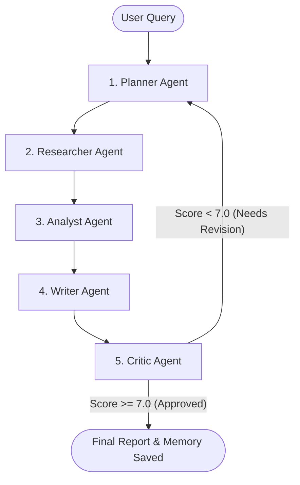

# 🔍 Deep Research Desk

An autonomous, multi-agent AI system designed to research any topic, evaluate facts, and write comprehensive, publication-grade executive reports. 

This project consists of:
*   **agent-backend**: A FastAPI service orchestrating the multi-agent system using LangGraph, OpenAI GPT-4o, and Qdrant memory.
*   **agent-frontend**: A modern Next.js user interface to monitor the agents live, view research trajectories, and download the finished reports.

---

## 🏗️ How it Works (The Multi-Agent Workflow)

Instead of a single LLM prompt, the system splits the task among **five specialized AI agents** that collaborate through a structured workflow:



1.  **Planner**: Breaks the main topic down into specific sub-topics, generates optimized web search queries, and builds a research plan.
2.  **Researcher**: Executes queries using search APIs (like Tavily), scrapes web content, and retrieves raw context.
3.  **Analyst**: Evaluates the retrieved search content, extracts facts, resolves contradictions, and filters out noise.
4.  **Writer**: Consolidates the facts and writes a polished, structured markdown report with sections, key findings, and inline sources.
5.  **Critic**: Scores the report out of 10. If the score is below the threshold (default: 7.0), it provides critical feedback and routes the task back to the Planner for another iteration. If approved, the report is finalized and saved.

---

## 📂 Project Structure

```
Ingenious-agentic/
├── agent-backend/          # FastAPI Python Server
│   ├── app/                # Main Application Logic (agents, models, api, config)
│   ├── docker/             # Dockerfile & Docker Compose configurations
│   ├── .env.example        # Configuration template
│   └── requirements.txt    # Python dependencies
│
├── agent-frontend/         # Next.js React Web Application
│   ├── app/                # Page views & layouts
│   ├── components/         # Reusable UI elements (dashboard, viewer, settings)
│   └── lib/                # API client functions
```

---

## 🚀 Running Locally

### 1. Backend Setup
Make sure you have Python 3.11 installed.

1. Navigate to the backend directory:
   ```bash
   cd agent-backend
   ```
2. Create and activate a virtual environment:
   ```bash
   python -m venv venv
   # On Windows:
   venv\Scripts\activate
   # On macOS/Linux:
   source venv/bin/activate
   ```
3. Install dependencies:
   ```bash
   pip install -r requirements.txt
   ```
4. Configure environment:
   * Copy `.env.example` to `.env`
   * Fill in your `OPENAI_API_KEY` (or `GOOGLE_API_KEY` if using Gemini).
   * Fill in `TAVILY_API_KEY` for live search (or leave blank to use the built-in placeholder mock search).
5. Start the server:
   ```bash
   python -m uvicorn app.main:app --reload
   ```
   * The API docs will be available at: `http://localhost:8000/docs`

---

### 2. Frontend Setup
Make sure you have Node.js installed.

1. Navigate to the frontend directory:
   ```bash
   cd agent-frontend
   ```
2. Install dependencies:
   ```bash
   npm install
   ```
3. Configure environment:
   * Edit/create `.env.local`
   * Set `NEXT_PUBLIC_API_URL=http://localhost:8000/api`
4. Start the development server:
   ```bash
   npm run dev
   ```
   * Open `http://localhost:3000` in your browser.

---

## ☁️ Production Cloud Architecture (AWS)

The production stack is deployed on **AWS** for high availability, security, and scalability:

*   **AWS Fargate (ECS)**: Hosts the backend FastAPI Docker container serverlessly (no servers to manage).
*   **Application Load Balancer (ALB)**: Routes incoming frontend traffic to the running backend container, automatically managing health checks and routing.
*   **Amazon S3**: Holds the production configurations (`.env`) in a private, encrypted bucket which is injected dynamically into ECS tasks at startup.
*   **Qdrant Cloud**: A hosted vector database that stores the semantic memory of past research to enhance future search workflows.

---

## 🛠️ Tech Stack

*   **Backend**: Python, FastAPI, LangGraph, Pydantic, Uvicorn
*   **Frontend**: React, Next.js (App Router), Tailwind CSS
*   **Database**: Qdrant (Vector Database)
*   **AI Models**: OpenAI GPT-4o, Google Gemini (via SDKs)
*   **Cloud Infrastructure**: AWS ECS, ECR, Fargate, ALB, S3
